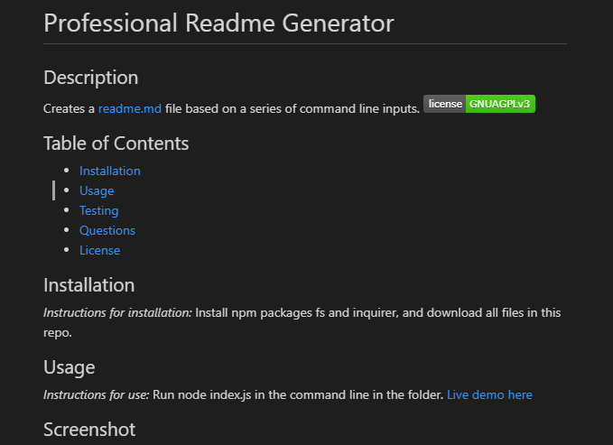

# Professional Readme Generator
## Description
Creates a readme.md file based on a series of command line inputs.

## Table of Contents
  * [Installation](#installation)
  * [Usage](#usage)
  * [Testing](#testing)
  * [Questions](#questions)
  * [License](#license)
    
    
## Installation
    
  _Instructions for installation:_
  Install npm packages fs and inquirer, and download all files in this repo. 
      
## Usage
  _Instructions for use:_
  Run node index.js in the command line in the folder.
  [Live demo here](https://watch.screencastify.com/v/sPtNRWio3AjteinFmzGQ)
## Screenshot

      
## Contribution
  _Are contributions welcome?_
  No.
      
## Testing
  _Instructions for testing application:_
  No test available now.
      
## Questions
      
  _For further questions:_
  Email
  
  _Contact Info:_
  GitHub: [wkropat](https://github.com/wkropat)
  Email: [wkropat@gmail.com](mailto:wkropat@gmail.com)
    
## License
      
  _This application uses the GNU AGPLv3 license._
      
  For more information please view the [license description](https://choosealicense.com/licenses/agpl-3.0/).
  
  
